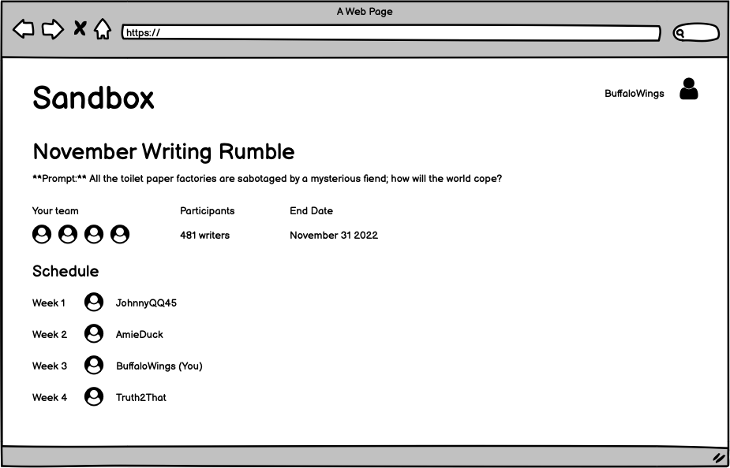
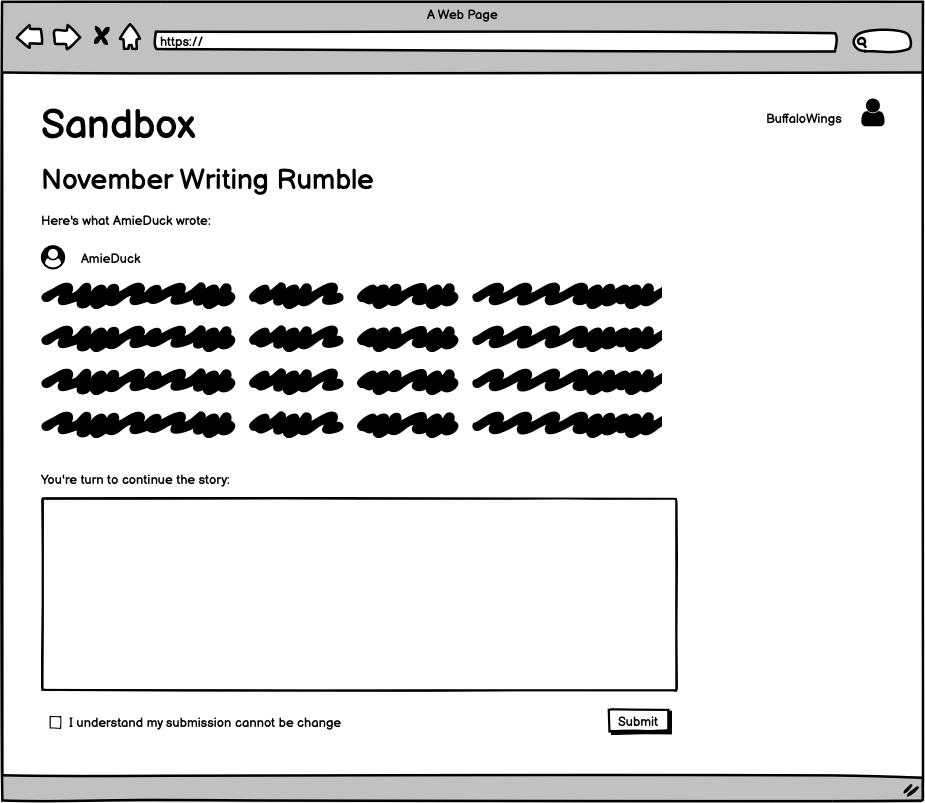

# RRFC12 - Collaborative Story Telling (Sandbox)
## Problem
Writing is often a solitary and independent task that is devoid of active collaboration. Feedback and tips for improvement can be difficult to acquire, and what's more, limited collaboration can cause a limited playfulness to the activity of writing. Finally, due to the limited environment pressure to complete a piece, many written works often go uncompleted due to overwhelm, lack of discipline/practice, and/or lost motivation.

## Solution
A collaborative story telling web application which allows pseudonymous writers to work together to improve their own creative writing skills, have fun, and complete a story together.

**Figure 1**: Contest screen

**Figure 2**: Submission screen

### User Journey
* A user signs up and builds a pseudonym which they will take their work under. 
	* Use of pseudonyms limits reputation risk and thereby broadens the horizon of creative exploration and potential improvement
* The user joins a writing competitions that are 3-5 weeks long.
* The user is assigned to a group of 3-5 other writers
* Over the period of the contest: 
	* Each user in the group completes 1-3 pages of the short story in serial format using as input the previous user's work.
	* Example:
		* User 1 writes 1-3 pages on the initial contest prompt
		* User 2 writes 1-3 pages in continuation of User 1's contribution
		* User 3 writes 1-3 pages in continuation of User 2's contribute and is NOT able to see User 1's contribution
		* et cetera
* At contest completion a random set of judges from the community is chosen to judge each short story and choose a winner

### Extensions
- The chosen group of users receive an NFT for their submission which they can sell or license 
- GPT-3 Integration for AI<>Human collaborative story telling

## Hypothesis
Aspiring writers and creatives are interested in collaborating with pseudonymous internet users on a short work in the interest of play and practice.

